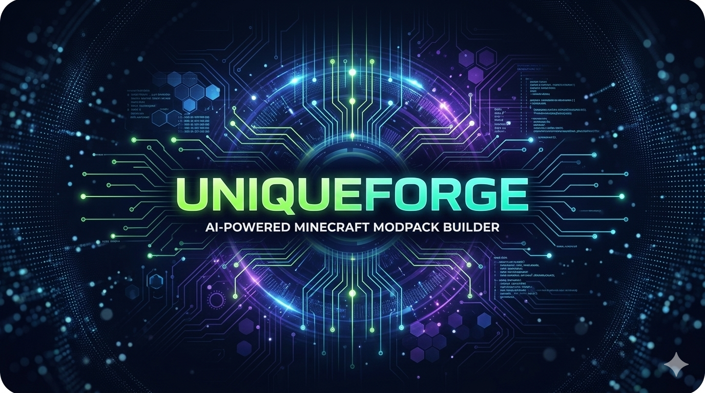
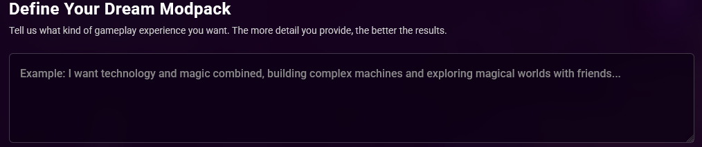
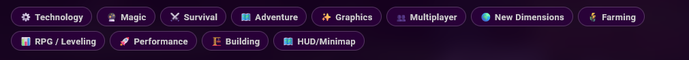
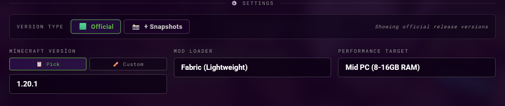

# 🛠️ UniqueForge Builder
### AI-Powered & Modern Minecraft Modpack Generator

**UniqueForge Builder** is a cutting-edge web-based tool designed for Minecraft players. It empowers users to craft custom modpacks in seconds by combining **AI-driven descriptions** with manual fine-tuning.

---

## ✨ Key Features

- 🤖 **AI-Powered Logic:** Describe your dream gameplay, and the AI selects the best mods for you.
- 🎨 **Modern UI/UX:** A sleek, dark-themed interface (#1a1a1a) with professional "Forge Green" (#62B346) accents.
- 📱 **PWA Support:** Installable as a standalone app on mobile and desktop devices.
- ⚡ **Lightweight:** Built with optimized HTML5/CSS3 for instant loading.

---

## 🚀 User Guide: How to Forge Your Pack

Follow these steps to create your unique Minecraft experience:

### Step 1: Describe Your Dream (AI Prompt)
Start by expressing your vision in the natural language prompt box. The AI analyzes your text to understand the "vibe" and requirements of your modpack.

*Example: "I want technology and magic combined, building complex machines and exploring worlds..."*

### Step 2: Choose Categories (Optional)
Refine your search by selecting specific categories. You can manually toggle these to ensure the system includes exactly the genres you love.

*Note: This step is optional. You can rely entirely on the AI or mix both.*

### Step 3: Configure Technical Settings
Critical for stability! Define your Minecraft version and preferred mod loader (Forge, Fabric, etc.) to ensure all generated mods are compatible.

### Step 4: Ignition
Once you are satisfied with your prompt and settings, hit the **Start** button to begin the generation process.

---

## ⚙️ How It Works (The Engine)

UniqueForge Builder follows a structured pipeline:

1.  **Environment Setup:** Your settings define the version and loader compatibility layer.
2.  **Intelligent Filtering:** The system cross-references your prompt with a database of verified mods.
3.  **Dependency Resolver:** It automatically identifies and flags necessary library mods.
4.  **Manifest Output:** Generates a structured mod list ready for your favorite launcher.

---

## 🎨 Technical Design & Palette

| Component | Hex / Value |
| :--- | :--- |
| **Primary Accent** | `#62B346` (Forge Green) |
| **Main Background** | `#1a1a1a` (Modern Dark) |
| **Typography** | `Roboto Family & Mono` |
| **Viewport** | `Viewport-fit=cover` (Mobile Optimized) |

---

## 🤝 Contributing

Contributions make the open-source community amazing! Here is how you can help:

1. **Fork** the Project.
2. Create your **Feature Branch** (`git checkout -b feature/AmazingFeature`).
3. **Commit** your Changes (`git commit -m 'Add some AmazingFeature'`).
4. **Push** to the Branch (`git push origin feature/AmazingFeature`).
5. Open a **Pull Request**.

---

## 📄 License

Distributed under the **MIT License**. See `LICENSE` for more information.

---

## 👤 Contact

**Yalçın Unique**
- **GitHub:** [@yalcinunique](https://github.com/yalcinunique)
- **Project Link:** [UniqueForge-Builder](https://github.com/yalcinunique/UniqueForge-Builder)

*"Forge your world, build it Unique."*
